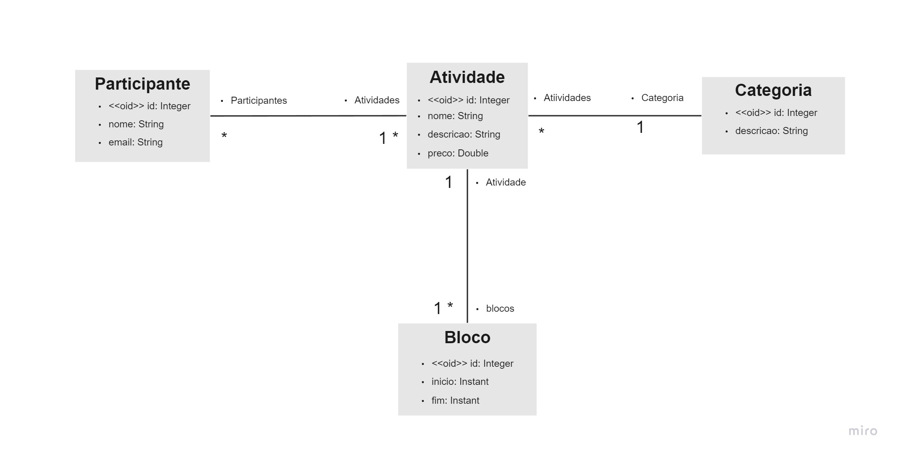
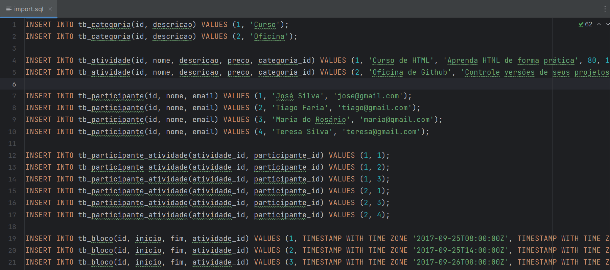
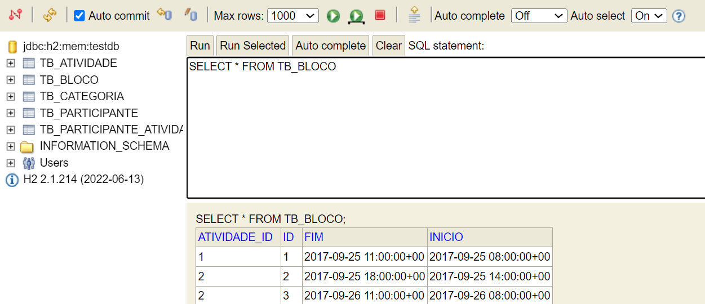
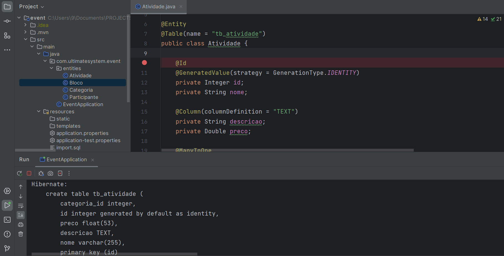

# Event System!

### This is a Spring Boot project and H2 database, which implements the following conceptual model:
&nbsp;

The objective of the system is to manage the information of participants in the activities of a
academic event. The activities of this event can be, for example, lectures, courses, workshops
practices, etc. Each activity that takes place has a name, description, price, and can be divided into several blocks of time (for example: an HTML course can take place in two blocks, requiring
store the day and the start and end times of that day's block). For each participant, you want to register your name and email.

&nbsp;
### Through the bank seed, participants, activities, categories and time blocks are added:
&nbsp;

&nbsp; 
&nbsp; 

### H2 database:

&nbsp; 
&nbsp; 

To create this system, the following were done:

- Implementation of domain entities

- Object-relational mapping with JPA

- Spring Boot project setup for H2 database

- H2 database seeding
&nbsp;

&nbsp;
&nbsp;
Use ORM, or Object Relational Mapping, simplifies the experience of interacting with a relational database, bridging the gap between the object-oriented programming world and the relational database world. This is done through the following mechanisms:

- Abstraction of database operations
- Mapping between objects and tables
- Automatic SQL generation

         
&nbsp;
 

&nbsp; 
&nbsp; 

As you can see, the data was correctly generated in the database and the Domain Model was successfully implemented.

# Event System

Welcome to the Event System README! This Spring Boot project, backed by an H2 database, serves as a comprehensive solution for managing academic event activities and participant information. Let's delve into its key components:

## Conceptual Model

The system is designed to handle various activities within an academic event, ranging from lectures to workshops and courses. Each activity includes details like name, description, price, and can be segmented into time blocks.

## Getting Started

To get up and running, seed essential data into the H2 database, including participants, activities, categories, and time blocks:

## Database Setup

The system leverages the H2 database for efficient data management:

## Development Journey

- Defined domain entities to encapsulate core functionalities.
- Utilized Object-Relational Mapping (ORM) with JPA for seamless database interaction.
- Configured the Spring Boot project for integration with the H2 database.
- Seeded the H2 database to initialize essential data.

## Object-Relational Mapping (ORM)

ORM simplifies database interactions by abstracting away complexities and enabling seamless mappings between objects and relational structures.

## Conclusion

With meticulously curated data and a robust Domain Model, the Event System on GitHub stands as a testament to successful implementation and commitment to excellence.

